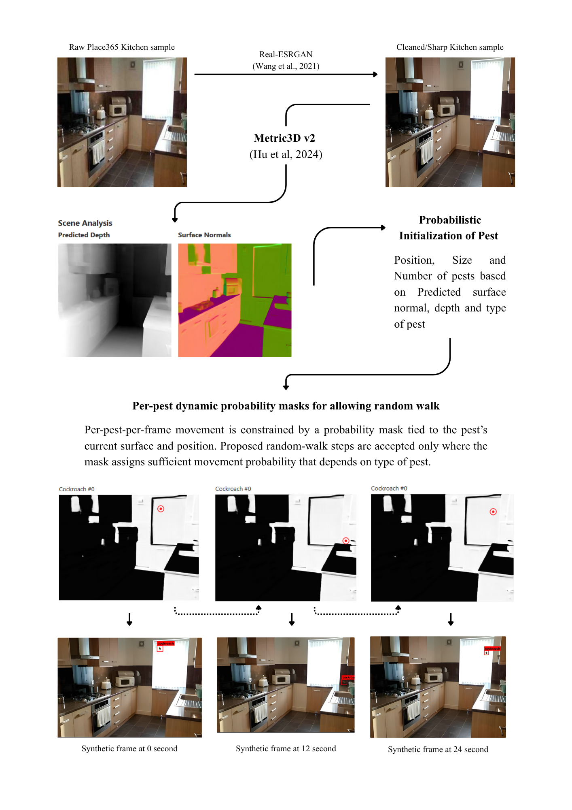

# Synthetic Data Generation for Pest Detection in Kitchens

A Python pipeline that composites 2D pest sprites onto real kitchen backgrounds to generate large-scale, auto-labeled synthetic video datasets for training pest detection models (mouse, rat, cockroach).

## Demo


*Bounding boxes: mouse · rat · cockroach*

---

## Motivation

Commercial kitchens face a critical hygiene challenge: pest sightings are rare, privacy concerns prevent camera access, and manually labeling thousands of hours of security footage is prohibitive. This pipeline bypasses all three constraints by generating synthetic frames with automatic COCO annotations — no human labeling required.

Our original approach used Blender to render physics-based 3D video, but full 3D rendering took ~110 hours for 1,000 thirty-second videos. We pivoted to 2D sprite compositing, which generates the same volume in under 20 minutes while preserving depth-aware scaling, surface-guided placement, and realistic motion.

---

## Pipeline Overview



The pipeline follows a linear flow:

```
Static Kitchen Photo → Scene Analysis → Pest Initialization → Frame Compositing → COCO Export
```

### 1. Kitchen Image Curation

Kitchen backgrounds come from two sources:

- **Places365** — 70 real commercial kitchen images manually curated from the Places365 validation split, providing realistic layouts, viewpoints, and clutter.
- **Gemini API** — 63 synthetically generated kitchen scenes increasing variation in lighting, cleanliness, and equipment placement.

All images are resized to the generator's standard frame format (640×480) before compositing.

### 2. Scene Analysis

For each kitchen image, the generator runs **Metric3D v2** (Hu et al., 2024) to estimate:

- A **metric depth map** — approximate distance-from-camera per pixel.
- **Per-pixel surface normals** — orientation of every visible surface.

Normals are grouped into surface categories: upward-facing surfaces (floor/counter/shelf), left-facing walls, right-facing walls, camera-facing vertical surfaces, and undersides/ceilings. This gives the 2D image a lightweight geometric structure without full 3D reconstruction.

### 3. Probabilistic Pest Initialization

For every video, the pipeline samples:

- **Number of pests** (including zero-pest null cases):
  - `P(N=0) = 0.25`
  - `P(N=1) = 0.30`
  - Remaining 0.45 distributed exponentially over `N=2..6`
- **Pest type** per slot:
  - Cockroach `0.50` · Mouse `0.30` · Rat `0.20`

Spawn locations are not uniform — each pest samples a starting surface based on species-specific behavior. Mice and rats spawn mostly on upward-facing surfaces (floors, counters); cockroaches may also spawn on walls or undersides.

### 4. Per-Pest Dynamic Probability Masks

Each pest receives movement probability masks derived from predicted surface normals. These masks favor the pest's current surface and suppress unlikely transitions based on a species-specific **surface stickiness** value. Each proposed movement step is checked against the active mask — high-probability regions allow movement, low-probability regions redirect the step — keeping motion physically plausible while allowing limited surface transitions.

### 5. Depth-Aware Scaling and Motion

The local depth value at the pest's spawn position determines its apparent size in the frame. The generator combines predicted depth, estimated focal length, and real-world pest body length to compute a depth-aware sprite scale, then applies a global size multiplier (1.8×) for visibility.

Depth also governs motion: pests farther from the camera move fewer pixels per frame, while nearby pests move more visibly, preserving perspective consistency across the video.

### 6. Frame Compositing and COCO Export

For each frame, the generator:

1. Copies the kitchen background.
2. Loads the selected RGBA pest sprite for the current animation frame.
3. Resizes it using the computed depth-aware scale.
4. Rotates it to match the pest's movement direction.
5. Alpha-composites it onto the scene.

Because the generator controls exact sprite position, rotation, and size at every frame, it automatically computes 2D bounding boxes and exports annotations in standard **COCO JSON** format.

**Classes:**
| ID | Name |
|----|------|
| 0  | Mouse |
| 1  | Rat |
| 2  | Cockroach |

---

## Dataset

Hugging Face dataset: **[adR6x/pest_detection_dataset2](https://huggingface.co/datasets/adR6x/pest_detection_dataset2)**  
Metadata file used for split statistics: `generated_state.json`

> **Video-level pest prevalence by split**  
> Percentages are computed at the **video** level (from `generated_state.json`), where `mouse/rat/cockroach` means videos containing at least one of that pest (categories can overlap), and `none` means zero pests in the video.
>
> | Split | Mouse | Rat | Cockroach | None |
> |---|---:|---:|---:|---:|
> | Train (n=2837) | 35.78% | 26.37% | 52.20% | 26.26% |
> | Val (n=345) | 37.10% | 25.51% | 51.88% | 25.51% |
> | Test (n=818) | 35.45% | 30.07% | 50.37% | 24.08% |

---

## Web App

A Flask web app provides a UI for curation, generation, and dataset prep across four tabs:

1. **Test Video Generator** — Generate one synthetic video from a selected kitchen image; view frame overlays and scene analysis previews.
2. **Real Video Generator** — Batch-generate training jobs from curated kitchens with configurable length, FPS, and MP4 output.
3. **Kitchen Curator** — Review uncurated images; keep (moves to `curated_img/`) or delete.
4. **Kitchen Generator** — Generate new kitchen backgrounds with the Gemini API.

### Setup

Requires Python 3.10+ (Python 3.12 recommended).

**macOS / Linux / WSL**
```bash
bash setupUNIX.sh
poetry shell
```

**Windows (PowerShell)**
```powershell
.\setupPC.ps1
poetry shell
```

### Run

```bash
flask --app app.main run
# Open http://localhost:5000
```

---

## Output Layout

```text
outputs/
  train/
    frames/{job_id}/        # sparse frame images (frame_0001, frame_0010, ...)
    labels/{job_id}/        # COCO annotations.json
    videos/{job_id}.mp4     # optional MP4
  test/
    frames/{job_id}/
    labels/{job_id}/
    videos/{job_id}.mp4
  generated_state.json      # full metadata for all generated jobs

generator/kitchen_img/
  curated_img/              # approved kitchens (kitchen_####.jpg)
  uncurated_img/            # pending review
  test_train_split.csv      # kitchen-level train/test assignment
```

---

## References

Hu, M., Yin, W., Zhang, C., Cai, Z., Long, X., Chen, H., Wang, K., Yu, G., Shen, C., & Shen, S. (2024). Metric3D v2: A versatile monocular geometric foundation model for zero-shot metric depth and surface normal estimation. *IEEE Transactions on Pattern Analysis and Machine Intelligence, 46*(12), 10579–10596. https://doi.org/10.1109/TPAMI.2024.3444912

Wang, X., Xie, L., Dong, C., & Shan, Y. (2021). Real-ESRGAN: Training real-world blind super-resolution with pure synthetic data. *Proceedings of the IEEE/CVF International Conference on Computer Vision Workshops (ICCVW)*, 1905–1914.
