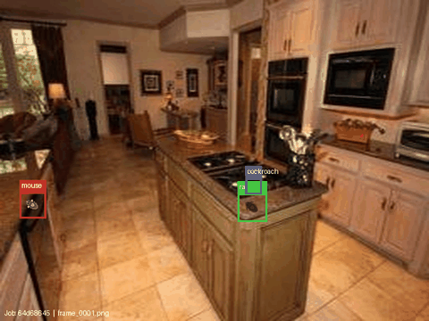

# Pest Detection Dataset (Synthetic, COCO Format)

A synthetic dataset for pest detection in kitchen/indoor surveillance scenarios.
All videos and annotations are procedurally generated using a custom pipeline.

## Demo — Job `64d68645` (1 mouse · 1 rat · 1 cockroach)



*Bounding boxes: 🔴 mouse &nbsp; 🟢 rat &nbsp; 🔵 cockroach*

---

## Dataset Statistics

| Split     |  Jobs  | Frames  | Annotations | 🐭 Mouse | 🐀 Rat  | 🪳 Cockroach | Empty Jobs  |
|-----------|-------:|--------:|------------:|---------:|--------:|-------------:|------------:|
| train     |  1,460 |  36,500 |      55,650 |   16,200 |  10,975 |       28,475 | 368 (25.2%) |
| val       |    298 |   7,450 |      11,650 |    3,225 |   2,375 |        6,050 |  76 (25.5%) |
| test      |    308 |   7,700 |      11,575 |    3,575 |   2,025 |        5,975 |  84 (27.3%) |
| **total** |**2,066**|**51,650**|    **78,875**|**23,000**|**15,375**|      **40,500**| **528 (25.6%)** |

---

## Pest Categories

| ID | Name | Description |
|----|------|-------------|
| 1  | mouse | House mouse |
| 2  | rat | Common rat |
| 3  | cockroach | Cockroach |

---

## Dataset Structure

```
├── annotations/
│   ├── train.json       # COCO-format annotations for train split
│   ├── val.json         # COCO-format annotations for val split
│   └── test.json        # COCO-format annotations for test split
├── images/
│   ├── train/
│   │   └── {job_id}/    # One folder per video job (~25 frames each)
│   │       ├── frame_0001.png
│   │       ├── frame_0010.png
│   │       └── ...
│   ├── val/
│   │   └── {job_id}/
│   └── test/
│       └── {job_id}/
├── generated_state.json  # Full metadata for all 2,066 generated jobs
└── demo.mp4              # Demo video with bounding box overlays
```

### Why job-ID subfolders?
Frames from the same synthetic video are grouped under one `{job_id}` folder.
This preserves temporal structure — consecutive frames in a folder belong to the same video sequence — enabling temporal models and frame-sequence dataloaders without needing extra metadata.

---

## Annotation Format (COCO)

Each annotation JSON follows the standard COCO object detection format:

```json
{
  "images": [
    {
      "id": 1,
      "file_name": "64d68645/frame_0001.png",
      "width": 640,
      "height": 480
    }
  ],
  "annotations": [
    {
      "id": 1,
      "image_id": 1,
      "category_id": 1,
      "bbox": [x, y, width, height],
      "area": 1234.5,
      "iscrowd": 0
    }
  ],
  "categories": [
    {"id": 1, "name": "mouse"},
    {"id": 2, "name": "rat"},
    {"id": 3, "name": "cockroach"}
  ]
}
```

Note: `file_name` includes the `{job_id}/` prefix — prepend `images/{split}/` to get the full path.

---

## Loading the Dataset

```python
from huggingface_hub import snapshot_download
import json, os
from PIL import Image

# Download the dataset
dataset_dir = snapshot_download("adR6x/pest_detection_dataset", repo_type="dataset")

# Load train annotations
with open(os.path.join(dataset_dir, "annotations", "train.json")) as f:
    coco = json.load(f)

# Load an image
img_info = coco["images"][0]
img_path = os.path.join(dataset_dir, "images", "train", img_info["file_name"])
img = Image.open(img_path)
```

---

## generated_state.json

Each entry in `generated_state.json` describes one generated video job:

```json
{
  "job_id": "64d68645",
  "split": "train",
  "mouse_count": 1,
  "rat_count": 1,
  "cockroach_count": 1,
  "length_of_video_seconds": 24.0,
  "fps": 10,
  "frames_dir": "images/train/64d68645",
  "labels_dir": "annotations/train.json",
  ...
}
```

Use this to filter jobs by pest composition, split, or other metadata.

---

## Data Sources

| Asset | Source | Details |
|-------|--------|---------|
| Kitchen backgrounds | [Places365](http://places2.csail.mit.edu/) + manually curated | 70 kitchen images selected from Places365 to cover diverse kitchen layouts, lighting conditions, and viewpoints |
| Pest models & animation | Custom synthetic pipeline | 3D pest models (mouse, rat, cockroach) procedurally animated and composited onto background images |
| Bounding box annotations | Auto-generated | Derived directly from the synthetic compositing process — no manual labelling required |

---

## Frame Sampling

Frames are sampled at every 10th frame from the original video (`--every_n 10` default), plus frame 1. Each job contributes ~25 frames at 640×480 resolution.
